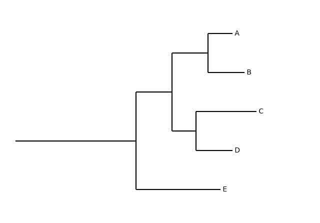
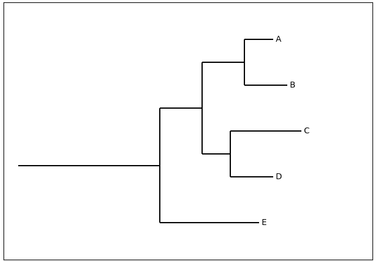
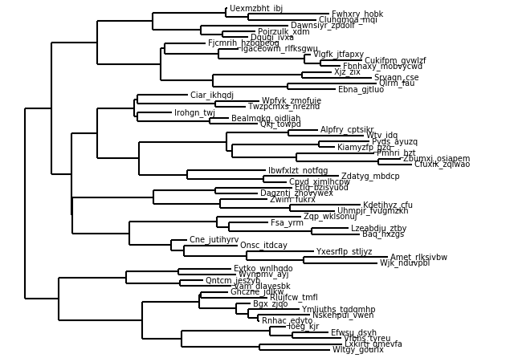
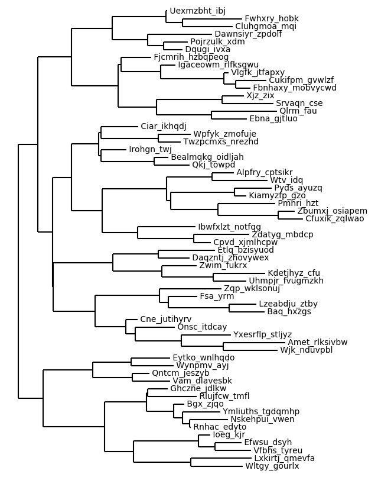

plottree
========

``plottree`` is a command line tool written in Python, building on to of
``matplotlib`` and ``Biopython.Phylo`` module. It is designed for
quickly visualize phylogenetic tree via a single command in terminal. Both
text file or string (surrounded by double quotes) in NEWICK format is
accepted as input. Several optional parameters are also accepted for
fine tuning the tree figure a little bit. If you just want to take a quick view
of a phylogenetic relationships of a tree file or from a tree string,
``plottree`` is the right tool for you, otherwise, please consider to use other
visualization tools (e.g., TreeView, iTOL, ...) if you care more about real
visualization and want to make more fancy figures.

Usage
=====

Once ``plottree`` was successfully installed and its executable can be found in
you system's search path, you can type ``plottree`` or ``plottree -h`` in
terminal to check the short help message for how to use ``plottree``. If you
need more examples of how to use ``plottree``, after reading the help message,
you can jump to the ``Examples`` part to learn more about efficently using
``plottree``.

::

    $ plottree
    PLOTTREE - Plot a phylogenetic tree with just a single line of code.

    Usage: plottree TREE [options]

    positional arguments:
      TREE                  A tree in NEWCIK format file or string (surrounded by
                            double quotes).

    optional arguments:
      -h, --help            show this help message and exit.
      -a, --axes            Display ticks for x and y axes.
      -b, --box             Display the tree inside a box.
      -m TOP BOTTOM LEFT RIGHT, --margin TOP BOTTOM LEFT RIGHT
                            Set the margins of the figure, four numbers in the
                            order of top bottom left and right.
      -s SIZE, --size SIZE  Set the fontsize of leaf and node names.
      -x MIN MAX, --xlim MIN MAX
                            Set the limits for x-axis, two numbers for min and max.
      -y MIN MAX, --ylim MIN MAX
                            Set the limits for y-axis, two numbers for min and max.
      -o OUTPUT, --output OUTPUT
                            Save the figure into a file.

Examples
========

Plot a tree in a NEWICK file::

    $ plottree <newick_tree_file>

    Plotting tree using the following setting:
          fontsize (-s): 10.0
          width (-w): 6.4
          height (-l): 4.8
          xlim(-x): -0.10, 2.50
          ylim(-y): 5.80, 0.20
      Feel free to modify them to tune the figure nice.

``plottree`` will plot the tree from the file and show the tree figure in a
window. In the terminal, it will display the parameters and their
corresponding values used for plotting the current figure. If you want to tune
the figure a little bit, just close the figure window and you will get your
terminal back. Inside the terminal, retrieve the last command, add some
additional parameters and run the command again. Repeat and try the optional
parameters until you get a ideal figure.

Plot a tree in a NEWICK string::

    $ plottree "(((A:0.2, B:0.3):0.3,(C:0.5, D:0.3):0.2):0.3, E:0.7):1.0;"

      Plotting tree using the following setting:
          fontsize (-s): 10.0
          width (-w): 6.4
          height (-l): 4.8
          xlim(-x): -0.10, 2.50
          ylim(-y): 5.80, 0.20
      Feel free to modify them to tune the figure nice.

Similar as plot tree from a NEWICK file, pass a double quote surrounded NEWICK
string will allow you to plot tree in a even more easier way. After running the
command you will see the tree was plotted in a window:

    A example for a simple tree

.. Note::

    Double quote surrounded NEWICK string as input is required. Depending on
    the setting of your system (more specifically, the setting of
    ``matplotlib``), the displayed parameters may be different from what you
    are seeing from here. No need to worry about that, just play around with
    them, you should be easily figure out how to tune the tree figure.

You can added a black boarded for the tree figure by adding ``-b`` flag::

    $ plottree "(((A:0.2, B:0.3):0.3,(C:0.5, D:0.3):0.2):0.3, E:0.7):1.0;"

      Plotting tree using the following setting:
          fontsize (-s): 10.0
          width (-w): 6.4
          height (-l): 4.8
          xlim(-x): -0.10, 2.50
          ylim(-y): 5.80, 0.20
          Plot a box surrounding the tree: -b
      Feel free to modify them to tune the figure nice.

It will show you a figure like this:

    Tree inside a box

For big trees (or trees with several leaves), tree branches will be crowded or
even overlapped with each other, you can tune the tree figure by several ways,
like decreasing fontsize (-s), increasing width (-w) and/or height (-l).

Assume you plot a tree in a file (``tree.newick``) using the following command::

    $ plottree tree.newick

And the tree displayed like this:

.. figure:: figures/CrowedTree.png
    :alt: Crowded tree
    :align: center

    An example of a crowded tree

Then you can try to decrease the fontsize to make it looks better::

    $ plottree tree.newick -s 8

This will make the tree looks like this:

    A crowded tree was relieved by decreasing fontsize

You can also try to increase the height (-l) to make the tree looks better::

    $ python plottree/plottree.py tree.newick -l 8.4

    A crowded tree was relieved by increasing figure height

Once you think the tree figure is good enough, you can save it by hit the
save icon in the figure windows or re-run the command with ``-o <output>``
option to save it.

Feel free to tune the figure with other options to make it even better.
However, ``plottree`` is not designed for generating fancy tree figures, if you
want to polish the tree figure and want it to be more fancy, I strongly suggest
you use other tree visualization tools and do not waste your time on
``plottree``, because it is only designed for quickly visualize phylogenetic
relationships.

Installation
============

``plottree`` can be easily installed using ``pip``::

    $ pip install plottree

This will install ``plottree`` and generate its executable script. See Q&A for
details, if you run into any problem during installation.

Q&A
===

Q: Do I need to have Python to use ``plottree``:
A: Yes, ``plottree`` is not a standalone program, it is a Python package with an
executable script made available for user once the package was installed.

Q: Which Python version do I need to use? Python 2 or 3?
A: It does not matter, it works well under both version. However, I do
recommend you to use Python 3 for future compatibility.

Q: Is there any dependency for ``plottree``?
A: Yes, ``plottree`` was built on top of ``matplotlib`` and ``Biopython.Phylo``
module. If you install ``plottree`` using ``pip``, they will be automatically
installed if they are not installed yet.

Q: Why it tells me "'plottree' is not recognized as an internal or external
command, operable program or batch file"?
A: Make sure you successfully installed ``plottree`` first. Then, make sure
``C:PythonX\\Scripts`` folder was added to your system path, if you installed
Python with the default options. If you installed Python with other options,
find the Scripts folder under Python installation folder and make sure the
folder was added to your system path and try again.

Q: Why it tells me "-bash: plottree: command not found"?
A: Make sure you successfully installed ``plottree`` first. Then, make sure the
executable script generated during ``plottree`` installation was installed to a
location that included into your ``PATH``, if not, add the location to PATH.

Q: After I run the command, why it does not release the prompt even I append
"&" after the command and try to put it running background?
A: It was intentionally designed like this. If you want to take your prompt
back, just close the figure window, and the prompt will come back
automatically. Once you need to see the figure again, just re-run the command.